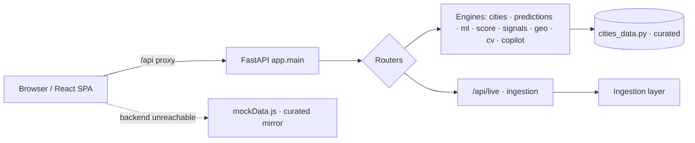
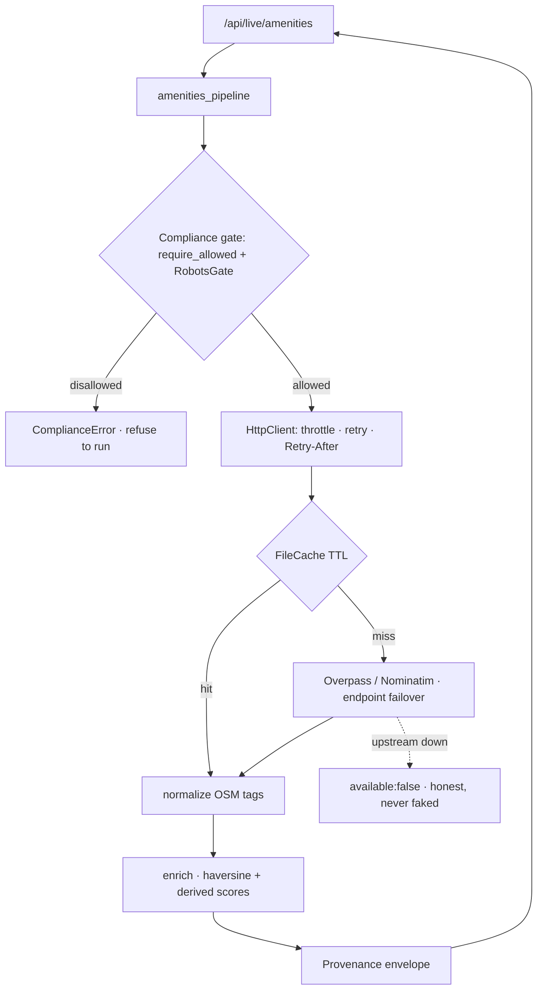
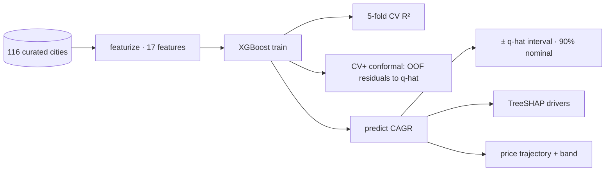

# LandAI — India Urban Growth Prediction Platform

> Predict **where India's land value will rise.** LandAI compares emerging Tier‑3
> cities with historically similar Tier‑2 cities, then forecasts which zones will
> develop over the next 5–10 years — before prices move.

LandAI is a full‑stack MVP: a **FastAPI** backend that serves a curated database of
**116 Indian cities across 25 states & UTs**, four analytical engines (an XGBoost
land‑price model, an NLP infrastructure‑signal parser, a shapely/PostGIS spatial
engine, and a computer‑vision urban‑growth raster pipeline), and a **React + Vite**
frontend with an interactive map, city analysis, and side‑by‑side comparison.

> **🔎 Built transparency‑first.** Every subsystem below is explicitly classified —
> **Real · Curated · Heuristic · Simulated** — and every *live* datapoint ships with
> provenance (`source · license · fetched_at · confidence · freshness_score`). We never
> present curated data as live, a heuristic as an institutional forecast, or rule‑based
> NLP as an LLM. See the **Truthfulness Audit**, **Data Provenance Matrix**, and
> **Model Cards** below.

---

## ✨ Features

| Area | What it does |
|------|--------------|
| 🗺️ **Interactive map** | All 116 cities plotted with tier / growth‑phase / investment‑score, filterable by state and tier. |
| 📍 **GPS "near you"** | Detects the visitor's location and surfaces the nearest cities first (e.g. land in Madhya Pradesh → Bhopal, Sagar, Ujjain… on top). |
| 🤖 **AI Copilot** | Rule-based natural-language query ("best city under ₹20 lakh near a metro", "alternatives to Bangalore") → ranked recommendations. No external LLM. |
| 🎯 **Investment scoring + explainability** | ROI / risk / liquidity / demand / future-development sub-scores, composite, plain-English rationale and XGBoost driver attribution. |
| 📊 **Analytics dashboard** | State comparison, tier/phase distributions, price-vs-score scatter, top opportunities. |
| ⭐ **Watchlist** | Save cities client-side (localStorage) — no login required. |
| 🔥 **Score heatmap + filters** | Investment-intensity heatmap toggle on the map; filter by state/tier/phase/budget and sort. |
| 📈 **Calibrated forecasts** | Phase-based bounded-CAGR growth with realistic ceilings + confidence-interval bands. |
| 📈 **Growth forecast** | Logistic S‑curve urban‑area model + compound land‑price forecast with 5/10‑year milestones. |
| 🧠 **XGBoost price model** | A *trained* gradient‑boosted regressor predicts land‑price CAGR from infrastructure/demographic features, with per‑prediction TreeSHAP attribution. Falls back to scikit‑learn if XGBoost is unavailable. |
| 📰 **NLP infrastructure signals** | TF‑IDF + rule‑based information extraction turns infrastructure announcements (highways, airports, metros, industrial corridors) into scored *leading indicators* with impact score and lead time. |
| 🛰️ **CV urban‑growth raster** | `scipy.ndimage` morphology over per‑year urban‑footprint rasters → compactness, fragmentation, dominant growth direction, plus a rendered multi‑temporal growth PNG. |
| 🌐 **Spatial / PostGIS** | shapely growth‑ring geometry served as GeoJSON; PostGIS‑ready via GeoAlchemy2 + a docker‑compose Postgres service (in‑memory fallback otherwise). |
| 👯 **Historical twin matching** | "City DNA" cosine‑similarity finds a more‑developed twin and time‑shifts its trajectory to forecast the target city. |
| ⚖️ **City comparison** | Compare any two cities' growth curves, prices, and investment metrics. |
| 🌍 **Live data ingestion** *(new)* | **Real, provenance-wrapped** OpenStreetMap amenities/infrastructure via the Overpass API + Nominatim geocoding. Every record carries `source · license · confidence · freshness`. ToS-protected listing portals are **compliance-gated (never scraped)**. See [`backend/app/ingestion`](backend/app/ingestion/README.md). |
| 🛡️ **Data Trust Layer** *(new)* | Global **live / cached / offline / curated** state: a `BackendHealthBanner` + per‑panel `DataStatusBadge` (Live · Curated · Heuristic · Simulated · Offline), provenance strips, freshness + confidence meters — backed by `/api/system/*`. **No more silent fallback.** |

---

## 🌍 Live Data Ingestion (real, not mock)

The curated 116-city database is now complemented by a **real data ingestion layer**
that fetches live intelligence from legally-permitted open sources and wraps every
dataset in a **provenance envelope** — `source · source_url · license · fetched_at ·
confidence · freshness_score · legality_note`. Nothing is fabricated: if a source is
down, the API returns an explicit `available: false` envelope instead of fake numbers.

```
GET /api/live/health                  # ingestion switch + config
GET /api/live/sources                 # source registry + live ToS-gate demonstration
GET /api/live/amenities/{city_id}     # real OSM amenities + derived accessibility/livability scores
GET /api/live/amenities?lat=&lng=     # …for any point
```

- **Permitted sources:** OpenStreetMap Overpass (ODbL) + Nominatim (ODbL).
- **Compliance:** listing portals (99acres/MagicBricks/Housing/CommonFloor) prohibit
  scraping in their ToS, so their adapter is **disabled by design** and refuses to run;
  a `RobotsGate` + `SOURCE_REGISTRY` enforce this. A licensed feed plugs in as a new
  permitted source.
- **Production-grade plumbing:** per-host rate limiting, retry/backoff (+`Retry-After`),
  endpoint failover, on-disk TTL caching, and fully transparent (documented) score formulas.

Full docs + architecture: [`backend/app/ingestion/README.md`](backend/app/ingestion/README.md).
Config: [`backend/.env.example`](backend/.env.example).

---

## 🏗️ Architecture

```
┌──────────────────────────────┐         ┌────────────────────────────────────────────┐
│         Frontend             │  /api   │                  Backend (FastAPI)           │
│   React 18 + Vite + Leaflet  │ ──────► │                                              │
│   Recharts · Framer Motion   │  proxy  │  api/      cities · predictions · ml ·       │
│                              │ ◄────── │            signals · geo · cv                │
│   Falls back to mockData.js  │  JSON   │  ml/       XGBoost land-price model          │
│   (mirrors the backend) when │         │  nlp/      TF-IDF signal parser + corpus     │
│   the API is unreachable     │         │  geo/      shapely geometry · PostGIS (opt)  │
└──────────────────────────────┘         │  cv/       scipy.ndimage raster morphology   │
                                          │  services/ logistic prediction · DNA matcher │
                                          │  data/     116-city curated database         │
                                          └───────────────┬──────────────────────────────┘
                                                          │ DATABASE_URL (optional)
                                                          ▼
                                                  PostGIS (docker-compose)
```

---

## 🗺️ System Design (data flows)

**Request flow**


**Ingestion flow (real data, fails honestly)**


**ML flow (XGBoost + conformal + SHAP)**


---

## 🧰 Tech stack

**Backend** — Python 3.11+, FastAPI, Uvicorn, NumPy, SciPy, scikit‑learn, **XGBoost**,
pandas, **shapely**, Pillow, and (optional) SQLAlchemy + GeoAlchemy2 + psycopg for PostGIS.

**Frontend** — React 18, Vite 5, React Router, Leaflet / React‑Leaflet, Recharts,
Framer Motion, Axios, Lucide icons.

**Infra** — Docker + docker‑compose (backend, frontend/nginx, PostGIS).

---

## 🚀 Quick start

### Prerequisites
- Python 3.11+ and Node 18+
- **macOS only:** XGBoost needs the OpenMP runtime → `brew install libomp`
  (on Linux it's `libgomp1`, already handled in the backend Dockerfile).

### One‑shot setup
```bash
./setup.sh
```

### Run (two terminals)
```bash
# Terminal 1 — backend
cd backend && source venv/bin/activate
uvicorn app.main:app --reload --port 8000

# Terminal 2 — frontend
cd frontend && npm run dev
```

- App:  http://localhost:5173
- API docs (Swagger): http://localhost:8000/docs

> If the backend is down, the frontend automatically serves the bundled
> `mockData.js` (a mirror of the 116‑city dataset), so the UI keeps working offline.

### Run with Docker (incl. PostGIS)
```bash
docker compose up --build
# frontend → http://localhost:3000   backend → http://localhost:8000
```
The compose file starts a PostGIS database and points the backend at it via
`DATABASE_URL`; the spatial `cities` table is created and seeded on startup.

---

## 🔌 API reference

Base URL: `http://localhost:8000`

### Cities
| Method | Path | Description |
|--------|------|-------------|
| GET | `/api/cities/` | List cities. Filters: `?q=`, `?state=`, `?tier=1..3` |
| GET | `/api/cities/states` | List of states |
| GET | `/api/cities/{city_id}` | One city (full record) |

### Predictions (logistic S‑curve + DNA matcher)
| Method | Path | Description |
|--------|------|-------------|
| GET | `/api/predictions/{city_id}` | Growth forecast (`?horizon=5..25`) |
| GET | `/api/predictions/{city_id}/full` | History + forecast + twin |
| GET | `/api/predictions/{city_id}/similar` | Most similar cities (`?top=`) |
| GET | `/api/predictions/{city_id}/twin` | Best historical twin |

### ML — XGBoost land‑price model
| Method | Path | Description |
|--------|------|-------------|
| GET | `/api/ml/model-info` | Model card: backend, train + 5‑fold CV R², RMSE/MAE, **conformal calibration**, feature importances |
| GET | `/api/ml/price/{city_id}` | Predicted CAGR **+ 90% conformal interval** + price trajectory (with band) + TreeSHAP (`?horizon=3..20`) |

### NLP — infrastructure signals
| Method | Path | Description |
|--------|------|-------------|
| GET | `/api/signals/` | Corpus stats + top TF‑IDF terms |
| GET | `/api/signals/{city_id}` | Ranked signals for a city (`?top=`) |
| POST | `/api/signals/analyze` | Parse free text → structured signal (`{"text": "..."}`) |

### Geo — spatial / PostGIS
| Method | Path | Description |
|--------|------|-------------|
| GET | `/api/geo/status` | Active backend (PostGIS vs in‑memory shapely) |
| GET | `/api/geo/cities.geojson` | All cities as a GeoJSON point layer |
| GET | `/api/geo/city/{city_id}/zones.geojson` | Growth‑zone polygons (extent + 5/10‑yr sectors) |
| GET | `/api/geo/city/{city_id}` | Spatial summary (extent, radii, expansion ratio) |
| GET | `/api/geo/nearby?lat=&lng=&radius_km=&top=` | Nearest cities to a point — PostGIS when attached, else in‑memory haversine (always works). Powers the GPS "near you" UI. |

### CV — urban‑growth raster
| Method | Path | Description |
|--------|------|-------------|
| GET | `/api/cv/{city_id}/metrics` | Per‑year morphology metrics + dominant growth bearing |
| GET | `/api/cv/{city_id}/growth-raster.png` | Multi‑temporal growth raster (PNG) |

### Score — investment scoring + explainability
| Method | Path | Description |
|--------|------|-------------|
| GET | `/api/score/{city_id}` | ROI/risk/liquidity/demand/future‑dev sub‑scores, composite, rationale, drivers |

### Copilot — natural‑language query
| Method | Path | Description |
|--------|------|-------------|
| GET | `/api/copilot/examples` | Example queries |
| GET/POST | `/api/copilot/query` | Parse an investor question → ranked city recommendations (`?q=` or `{"query":...}`) |

### Live data ingestion — real OpenStreetMap (provenance-wrapped)
| Method | Path | Description |
|--------|------|-------------|
| GET | `/api/live/health` | Ingestion switch + config |
| GET | `/api/live/sources` | Source registry + live ToS‑gate demonstration |
| GET | `/api/live/amenities/{city_id}` | Real OSM amenities + derived scores + provenance |
| GET | `/api/live/amenities?lat=&lng=` | …for any point (`?radius_m=&max_pois=`) |

### System / data trust
| Method | Path | Description |
|--------|------|-------------|
| GET | `/api/system/health` | Liveness + degraded systems + persistence mode |
| GET | `/api/system/status` | + model-card summary + subsystem honesty registry |
| GET | `/api/system/sources` | External source registry + data-class registry |
| GET | `/api/system/provenance` | Machine-readable provenance / honesty matrix |
| GET | `/api/system/metrics` | Per-endpoint latency/errors, cache hit/miss, ingestion failures/retries, model-inference timer |
| GET | `/api/system/performance` | SLA summary: error rate, p95 by endpoint, cache hit ratio, rate-limited count |

**Example**
```bash
curl "http://localhost:8000/api/ml/price/tirupati?horizon=10"
curl -X POST http://localhost:8000/api/signals/analyze \
  -H 'Content-Type: application/json' \
  -d '{"text":"NHAI approved the Rs 3200 crore Patna ring road; tenders awarded."}'
```

---

## 📁 Project structure

```
LandAI/
├── backend/
│   └── app/
│       ├── main.py              # FastAPI app + router wiring + PostGIS seed on startup
│       ├── api/                 # cities, predictions, ml, signals, geo, cv routers
│       ├── data/cities_data.py  # 116-city curated database (source of truth)
│       ├── services/            # logistic prediction engine + City-DNA matcher
│       ├── ml/price_model.py    # XGBoost land-price model (sklearn fallback)
│       ├── nlp/                 # TF-IDF signal parser + announcement corpus
│       ├── geo/                 # shapely geometry + optional PostGIS (db.py)
│       └── cv/urban_growth.py   # scipy.ndimage raster morphology + PNG render
├── frontend/
│   └── src/
│       ├── pages/               # Home, CityAnalysis, Compare
│       ├── components/          # MapView, AiIntelligence, PredictionChart, ...
│       └── utils/
│           ├── api.js           # fallback-aware API client
│           └── mockData.js      # AUTO-GENERATED mirror of the backend (offline fallback)
├── docker-compose.yml           # backend + frontend + PostGIS
├── setup.sh
└── LAND_AI_VISION.md            # long-term product vision & roadmap
```

The frontend fallback dataset is generated from the live backend:
```bash
python scripts/generate_mock_data.py   # regenerates frontend/src/utils/mockData.js from /api/cities
```

---

## 📊 The dataset

`backend/app/data/cities_data.py` holds **116 cities / 25 states & UTs** as compact tuples
expanded into rich records: multi‑year population (2001/2011/2021), urban area
(2001–2021), land price (2010/2015/2021), infrastructure flags, derived
infrastructure / connectivity / economic / investment scores, growth phase, growth
directions, government schemes, and a curated historical twin where known.

---

## 🔍 Truthfulness Audit (what is real)

Every subsystem is classified honestly. **Nothing here is fabricated or randomly generated.**

| Subsystem | Class | What's genuinely real | What it is *not* |
|---|---|---|---|
| Live OSM amenities/infra (`/api/live/*`) | 🟢 **REAL (live)** | live Overpass/Nominatim fetch, provenance, caching, ToS gate | needs a reachable **global** Overpass in some networks |
| XGBoost land‑price model | 🟢 **REAL model** / 🟡 curated labels | trained GBDT, 5‑fold CV, **conformal intervals**, TreeSHAP | labels derived from curated prices; n=116 (overfits) |
| Spatial geometry (`geo/`) | 🟢 **REAL** | shapely GeoJSON (same GEOS as PostGIS), haversine KNN | the geometry is *shaped by* the heuristic forecast |
| City‑DNA matcher | 🟢 **REAL algorithm** | cosine similarity over 11 normalized features | features come from curated data |
| Cities database | 🟡 **CURATED** | real names + GPS, census‑aligned population | area/price/infra are expert approximations, **not live quotes** |
| Growth forecast (`prediction_engine`) | 🟠 **HEURISTIC** | bounded phase‑based CAGR + infra multipliers | not learned; its confidence bands are **formulaic** |
| Investment scoring | 🟠 **HEURISTIC** + 🟢 SHAP | transparent weighted formulas; real SHAP drivers | sub‑score weights are hand‑set |
| NLP infra signals | 🟠 **classical** / 🟡 curated corpus | real TF‑IDF + cosine + regex extraction | **NOT** an LLM/transformer; corpus is a sample |
| Copilot | 🟠 **HEURISTIC** | deterministic regex/keyword NLU over the DB | **NOT** an LLM |
| CV urban‑growth raster | 🔵 **SIMULATED input** + 🟢 real CV | real `scipy.ndimage` morphology + PNG render | masks are procedural, **NOT** satellite segmentation |
| Frontend offline fallback | 🟡 **CURATED mirror** | `mockData.js` mirrors the curated backend | ✅ now **visible** via the Data Trust Layer (banner + badge) |

### ⚠️ Known trust gaps (being honest)
1. **Silent frontend fallback — ✅ FIXED (Stage 4 Data Trust Layer).** A global trust layer makes fallback visible: [`DataTrustContext`](frontend/src/context/DataTrustContext.jsx) polls [`/api/system/health`](backend/app/api/system.py); a `BackendHealthBanner` shows *"Backend unavailable — curated offline snapshot"* when unreachable, and every panel carries a `DataStatusBadge` (Live · Curated · Heuristic · Simulated · Offline). The Navbar's old hardcoded "Live" is gone. (The live `/api/live/*` endpoints already fail honestly with `available:false`.)
2. **Leakage risk in the price model.** The top feature `urban_area_cagr_01_21` (2001–2021) overlaps the target window (price CAGR 2010–2021) and is not knowable at forward‑prediction time. Treat CAGR as directional; a production retrain should use only pre‑window features.
3. **Small sample.** n=116 ⇒ train R² 0.969 vs CV R² 0.411 (overfit). Conformal intervals are wide and coverage is approximate.

---

## 🧾 Data Provenance Matrix

| Dataset | Class | Source | Live? | Update frequency | Confidence |
|---|---|---|---|---|---|
| City coordinates / names | Real | OSM / official | static | rarely | high |
| Population (2001/2011/2021) | Curated | Census‑aligned + projection | static | ~10 yr (census) | med‑high |
| Urban area / land price / infra flags | Curated | Expert approximation | static | manual | **directional only** |
| Amenities & infrastructure POIs | **Real (live)** | OpenStreetMap Overpass (ODbL) | ✅ | on request · 7‑day cache | per‑pull 0.55–0.99 |
| Geocoding | **Real (live)** | OpenStreetMap Nominatim (ODbL) | ✅ | on request · 30‑day cache | 0.85 |
| Infra announcement corpus | Curated | Hand‑built sample | static | manual | sample only |
| Listing prices (99acres, etc.) | **Not ingested** | ToS‑gated (disabled) | ⛔ | n/a | n/a until a licensed feed |

---

## 🧠 Model Cards

### XGBoost land‑price CAGR model — `backend/app/ml/price_model.py`
- **Task:** regress historical land‑price CAGR (2010→2021) from 17 infra/demographic features, then project forward.
- **Training data:** 116 curated cities (cross‑sectional); labels derived from curated prices.
- **Validation:** 5‑fold CV — **train R² 0.969 · CV R² 0.411 · RMSE 0.0022 · MAE 0.0017** (live at `/api/ml/model-info`).
- **Uncertainty:** **CV+ split‑conformal** intervals — `q̂ = 0.0153` CAGR, **90% nominal / 92.2% empirical OOF coverage**, n_cal = 116.
- **Explainability:** per‑prediction **TreeSHAP** + global importances. Top drivers: urban_area_cagr (0.33), growth_phase_rank (0.15), population_density (0.08).
- **Limitations & biases:** small‑n overfit (train ≫ CV); **leakage risk** (top feature window overlaps target); curated labels; output clamped to [0, 35%]. **Directional, not investment‑grade.**
- **Intended use:** relative ranking & exploration. **Misuse:** not a sole basis for transactions. **Fallback:** scikit‑learn GBR if XGBoost is unavailable.

### Growth forecast engine — `services/prediction_engine.py` · 🟠 heuristic
Phase‑based bounded CAGR + infra multipliers + logistic area S‑curve. Confidence bands here are **formulaic** (`1−0.05·h`), not statistical, and are labelled as such. Roadmap: adopt the conformal intervals above.

### NLP signal parser — `nlp/` · 🟠 classical, not LLM
TF‑IDF(1,2‑gram) + cosine retrieval + regex entity extraction + weighted type/status rules → impact score & lead time. Curated sample corpus. Same interface a transformer‑backed version would expose.

### CV urban‑growth — `cv/` · 🔵 simulated input + real CV
Real `scipy.ndimage` morphology (Polsby–Popper compactness, connected components, centroid‑shift bearing) + Pillow render, over **procedurally‑generated** masks. Swap the mask step for U‑Net/SAM over Sentinel‑2 to make it real.

### Investment scoring — `services/scoring.py` · 🟠 heuristic + real SHAP
Transparent weighted sub‑scores (ROI/risk/liquidity/demand/future‑dev) + real XGBoost SHAP drivers + template rationale.

---

## 📐 System & Gap Matrix

| System | Status | Prod‑ready? | Honest? | Enterprise‑ready? | Biggest missing piece |
|---|---|---|---|---|---|
| Live OSM ingestion | 🟢 real | ✅ | ✅ | 🟡 | global Overpass / self‑host; shared persistence |
| Provenance + compliance gate | 🟢 real | ✅ | ✅ | ✅ | — |
| XGBoost + conformal + SHAP | 🟢 real | 🟡 | ✅ | 🟡 | bigger real dataset; fix leakage |
| Growth forecast | 🟠 heuristic | 🟡 | ✅ (labelled) | ❌ | learned model + real intervals |
| Spatial / GeoJSON | 🟢 real | ✅ | ✅ | 🟡 | PostGIS at scale, vector tiles |
| NLP signals | 🟠 classical | 🟡 | ✅ | ❌ | live news feed + transformer |
| CV raster | 🔵 simulated | 🟡 | ✅ | ❌ | satellite segmentation model |
| Copilot | 🟠 heuristic | ✅ | ✅ | 🟡 | LLM + RAG over provenance |
| Frontend | 🟢 works | ✅ | ✅ | 🟡 | auth/session; wire ProvenanceStrip into more panels |
| Data Trust Layer | 🟢 real | ✅ | ✅ | ✅ | deeper per‑panel provenance wiring |
| AuthN/Z · billing · quotas | ❌ none | ❌ | — | ❌ | the entire monetization layer |
| Persistence (Postgres/Redis/Celery) | 🟡 optional / not running | 🟡 | — | ❌ | wire Celery Beat + Redis + migrations |
| Observability | 🟢 metrics + request IDs + structured logs | ✅ | — | 🟡 | export to Prometheus / OTel / Grafana at fleet scale |

- **Highest‑risk gaps:** (1) ~~silent frontend fallback~~ — ✅ fixed (Data Trust Layer); (2) price‑model leakage + small n (credibility); (3) ~~inbound rate‑limit~~ — ✅ added; the remaining gap is no inbound **auth** on the public API.
- **Highest‑impact next:** wire live OSM features into scoring/ML; visible provenance badges; add the Census/data.gov.in feed.
- **Fastest monetization:** API‑key tier + quota on `/api/live/*` — ingestion is the defensible, real moat.
- **Biggest tech debt:** no running persistence layer; ingestion cache is on‑disk per‑process.

### Degradation matrix (fail visibly, never silently)
| Failure | Detected by | User-visible state | Fallback |
|---|---|---|---|
| Backend unreachable | health poll / network error | 🔴 "Backend unavailable" banner; every badge → **Offline snapshot** | curated `mockData.js` mirror |
| Live source (Overpass) down | `available:false` envelope | Live panel shows an honest "unavailable" card | **no fabricated numbers** |
| Live ingestion disabled | `degraded_systems` | 🟡 degraded banner | curated data only |
| Rate limit hit (429) | API interceptor | 🔵 "briefly throttled" banner (auto‑clears) | user retries after `Retry-After` |
| Heuristic / simulated output | inline provenance badge | 🟣 Heuristic · 🔵 Simulated · Model label on the panel | n/a — labelled, never hidden |

### Stage 4.5 enterprise audit
| System | Honest | Observable | Rate-limited | Provenance-aware | Enterprise-ready |
|---|---|---|---|---|---|
| Live OSM ingestion | ✅ | ✅ | ✅ | ✅ inline strip | 🟡 self‑host Overpass |
| XGBoost + conformal | ✅ | ✅ inference timer | ✅ | ✅ Model badge | 🟡 small n |
| Growth forecast | ✅ labelled | ✅ | ✅ | ✅ Heuristic badge | ❌ heuristic |
| Investment scoring | ✅ labelled | ✅ | ✅ | ✅ Heuristic badge | 🟡 |
| NLP signals | ✅ labelled | ✅ | ✅ | ✅ Heuristic badge | ❌ |
| CV raster | ✅ labelled | ✅ | ✅ | ✅ Simulated badge | ❌ |
| Geo / GeoJSON | ✅ | ✅ | ✅ | 🟡 strip pending | 🟡 |
| Data Trust Layer | ✅ | ✅ | n/a | ✅ | ✅ |
| Observability | ✅ | ✅ self | n/a | n/a | 🟡 export pending |
| Auth / billing | ❌ none | — | — | — | ❌ |

**Remaining blind spots:** no inbound **auth**; metrics are in‑process (not exported); the **Analytics / Compare / Copilot** panels are not yet provenance‑wrapped; persistence not running.

---

## 🔐 Security
- **Outbound rate limiting:** per‑host throttle in [`http_client.py`](backend/app/ingestion/http_client.py).
- **Inbound rate limiting:** ✅ implemented — an in‑process per‑IP token bucket ([`ratelimit.py`](backend/app/ratelimit.py)): `RATELIMIT_RPM` / `RATELIMIT_BURST`, returns `429` + `Retry-After` + `X-RateLimit-*` headers; health probes and CORS pre‑flight exempt. ⚠️ Single‑instance (move the bucket to Redis for multi‑replica deployments).
- **Secrets:** env‑driven via `.env` ([`backend/.env.example`](backend/.env.example)); none committed. The OSS open‑data path needs no keys.
- **CORS:** set in `main.py` (currently permissive `*` for dev — **lock to known origins in prod**).
- **AuthN/Z:** none yet (roadmap: JWT/OAuth + API keys). Treat the current API as public/unauthenticated.
- **Compliance gate:** `SOURCE_REGISTRY` + fail‑closed `RobotsGate` prevent disallowed fetches — a legal/security control, enforced **and tested**.
- **Abuse prevention (roadmap):** API keys, quotas, per‑key limits, request signing for enterprise tiers.

## 📈 Scalability
- **Stateless API** → scale horizontally behind a load balancer; the model is a thread‑safe, lazily‑trained in‑process singleton.
- **Ingestion concurrency:** async httpx + per‑host throttle; safe to fan out. Move the on‑disk cache to **Redis** for multi‑replica sharing.
- **Async jobs (roadmap):** Celery + Redis Beat schedules (listings 6 h, infra daily, census monthly, sentiment hourly) — designed, not yet running.
- **PostGIS:** optional today (in‑memory shapely fallback); for millions of geometries use PostGIS + spatial indexes + vector tiles.
- **Caching:** TTL disk cache (amenities 7 d, geocode 30 d) → Redis / CDN edge cache for `/api/live/*` at scale.

## 🔭 Monitoring & Observability
- **Now (implemented):** every request carries an `X-Request-ID` + `X-Response-Time-ms` header and a structured log line ([`metrics.py`](backend/app/metrics.py)). An in‑process collector exposes [`/api/system/metrics`](backend/app/api/system.py) (per‑endpoint count / avg / p50 / p95 / errors, cache hit‑miss, ingestion source‑failures / retries, fallback activations, a `model_inference` timer) and `/api/system/performance` (error rate, slowest endpoints, cache hit ratio, rate‑limited count). Each live response's `confidence` / `freshness_score` / `cache_hit` is itself a trust signal.
- **Roadmap:** export to Prometheus + OpenTelemetry tracing + Sentry + Grafana dashboards, alerting on freshness decay. ⚠️ the collector is **single‑instance** (resets on restart) — aggregate centrally at fleet scale.

## 🚢 Production Deployment
- **Docker:** `docker compose up --build` runs backend + frontend (nginx) + PostGIS; the backend image installs `libgomp1` for XGBoost.
- **Env:** copy `backend/.env.example` → `.env`; set `INGESTION_CONTACT`, `OVERPASS_ENDPOINTS` (a reachable **global** instance or self‑hosted), `DATABASE_URL` for PostGIS, and lock `CORS`.
- **Kubernetes‑readiness:** stateless API → Deployment + HPA; add Redis + a Celery worker/Beat Deployment; PostGIS as a managed DB; readiness probe `/health`.
- **Scaling notes:** pin Overpass to a self‑hosted instance for throughput; share cache via Redis; CDN in front of read‑heavy `/api/live/*`.

## ⏱️ Benchmarks & Performance
Measured warm, in‑process (Apple Silicon, single core; indicative):

| Operation | Latency |
|---|---|
| ML `predict_price_growth` (warm) | ~0.5 ms |
| Investment score (+SHAP) | ~0.5 ms |
| GeoJSON growth zones (shapely) | ~0.6 ms |
| NLP signals per city | ~0.7 ms |
| CV raster metrics (scipy, 200² grid) | ~4.7 ms |
| Test suite (31 tests) | ~1.4 s |
| Live amenities — cache **hit** | disk read (~ms) |
| Live amenities — cache **miss** | one Overpass round‑trip (~1–3 s, network‑bound) + throttle |

Conformal calibration: **92.2% empirical coverage** at 90% nominal (n=116).

## ⚖️ Compliance & Ethics
- **No illegal scraping.** Listing portals (99acres/MagicBricks/Housing/CommonFloor) forbid automated extraction in their ToS → their adapters are **disabled by design** and refuse to run; `RobotsGate` is fail‑closed.
- **Licensing:** live data is OpenStreetMap under **ODbL 1.0** with attribution surfaced in every `provenance` block and at `/api/live/sources`.
- **Provenance philosophy:** every datapoint carries source/license/fetched_at/confidence/freshness; failures return `available:false`, never fabricated numbers.
- **Explainability philosophy:** forecasts ship with SHAP drivers, conformal intervals, and documented formulas; heuristics are labelled as heuristics.
- **Not investment advice.** Outputs are data‑driven estimates for research/exploration; curated figures are directional. Validate with local, licensed due diligence before any transaction.

## 🗺️ Enterprise Roadmap
- **Data:** Census / data.gov.in demographics, NHAI / PM Gati Shakti infra, RERA builder intelligence, news → sentiment; persist to PostGIS; Celery Beat refresh.
- **ML:** real multi‑year price panel, fix leakage, time‑aware validation, ensemble + quantile models, drift monitoring.
- **AI Copilot:** LLM + **RAG over the provenance store** + vector DB so answers cite live sources.
- **Platform:** JWT/OAuth, API keys, quotas, billing/subscriptions, usage analytics, white‑label dashboards.
- **Geospatial:** vector tiles, flood/zoning overlays, satellite segmentation (U‑Net/SAM) to make CV real.

---

## 📝 Disclaimer
LandAI is an analytics & research tool — **not** investment advice or a valuation
service. Curated figures are directional approximations; live figures are limited to
what open sources (OpenStreetMap, ODbL) provide. Forecasts carry uncertainty (see
the conformal intervals and confidence scores). Always validate with local, licensed
due diligence before any property decision.
